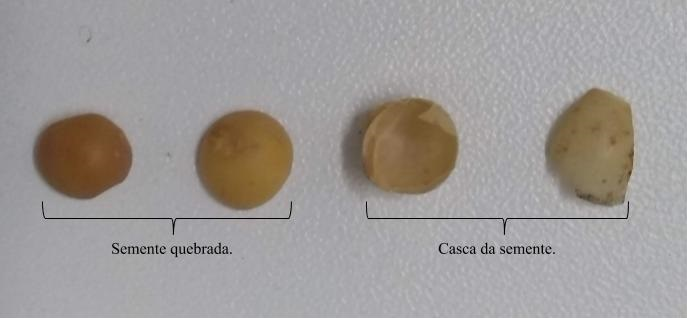
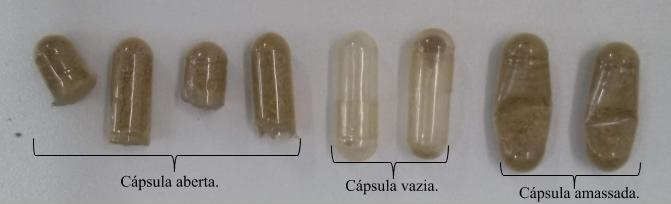
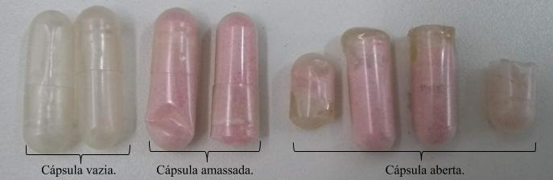

# Sanick Equipamentos de Precisão
Este repositório contém vídeos apresentando cápsulas e sementes movimentando sobre uma esteira, o objetivo é utilizar das ferramentas de Visão Computacional para identificar defeitos nas mesmas.

##  Começando
**1. Clone este repositório**
```sh
git clone https://github.com/Sanick-Equipamentos/desafioVisao.git
```

**2. Acesse os vídeos**
```sh
cd desafioVisao/desafioEsteira
```

## Informações dos objetos
Abaixo quantidades de objetos e imagens com os defeitos e respectiva descrição.

#### Quantidade de objetos bons e defeituosos
Jupyter Notebook com algumas funções:
> /quantidades.ipynb

Arquivo .csv disponível em:
> /Info/quantidade.csv

#### Defeitos semente de soja

* Semente quebrada.
* Casca da semente.

#### Defeitos da cápsula marrom

* Cápsula aberta.
* Cápsula vazia.
* Cápsula amassada.

#### Defeitos da cápsula rosa

* Cápsula vazia.
* Cápsula amassada.
* Cápsula aberta.